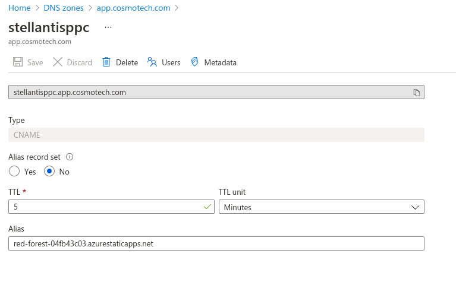

---
hide:
- toc
---
# WebApp Deploy

`babylon webapp deploy` will create a static webapp and configure it with the sample webapp source code.

This includes:

  - Creating and configuring an Azure Static WebApp resource
  - Creating and configuring an Azure Active Directory App Registration
  - Creating an Application Insights
  - Configuring the Sample WebApp source code
  - Adding access to the PowerBI Workspace

!!! note ""
    ```bash
    babylon powerbi deploy-workspace --help
    # Usage: babylon webapp deploy [OPTIONS]
    #
    #   Macro command that deploys a new webapp
    #
    # Options:
    #   --enable-powerbi  Enable PowerBI configuration
    #   -h, --help                      Show this message and exit.
    ```

???+ warning "Requirements"
    This macro requires a github repository with the destination branch already created
    
    1. [import a project](https://github.com/new/import) in Github
    2. Choose to clone the project azure-sample-webapp by setting the repository URL to https://github.com/Cosmo-Tech/azure-sample-webapp
    3. clone & configure
    ```bash
      git clone git@github.com:<GITHUB_REPOSITORY_URL>  # Replace by the URL of your own repository (e.g. Cosmo-Tech/azure-supplychain-webapp.git)
      cd <YOUR REPOSITORY_NAME> # Replace by the name of the folder created by "git clone"
      git remote add upstream git@github.com:Cosmo-Tech/azure-sample-webapp.git
      git remote set-url upstream --push "NO"
      git fetch upstream
    ```

!!! info "DNS Record"
    DNS Record creation is intently not supported by Babylon.  
    If you want a DNS of the form `[deployment_name].app.cosmotech.com` you should

    1. Create a new DNS record for the webapp domain name:
      > Azure Portal > DNS Zones > app.cosmotech.com > "+ Record set"

    2. Configure the DNS as below:
        ```yaml
        name: <DOMAIN_NAME_PREFIX> (the prefix of the domain name that will be used in front of app.cosmotech.com; e.g.  lorealppc.dev for lorealppc.dev.app.cosmotech)  
        type: CNAME  
        alias record set: No  
        TTL: 5 minutes  
        alias: <AZURE_STATIC_APPS_DOMAIN> (automatically generated when you created the static web app; e.g icy-island-123456789.0.azurestaticapps.net)  
        ```
        

???+ note "Options"
    === "`--enable-powerbi`"
        This option will enable powerbi configuration steps **9**, **10** and **11**.
   
???+ abstract "Steps"
    1. [babylon azure staticwebapp create](https://cosmo-tech.github.io/Babylon/latest/cli/#create_10)
    2. [babylon azure staticwebapp custom-domain create](https://cosmo-tech.github.io/Babylon/latest/cli/#create_11) - Optional
    3. [babylon azure ad app create](https://cosmo-tech.github.io/Babylon/latest/cli/#create_5)
    4. [babylon azure ad group member add](https://cosmo-tech.github.io/Babylon/latest/cli/#add) - Optional
    5. [babylon azure appinsight create](https://cosmo-tech.github.io/Babylon/latest/cli/#create_8) - Optional
    6. [babylon webapp download](https://cosmo-tech.github.io/Babylon/latest/cli/#download_2)
    7. [babylon webapp update-workflow](https://cosmo-tech.github.io/Babylon/latest/cli/#update-workflow)
    8. [babylon webapp export-config](https://cosmo-tech.github.io/Babylon/latest/cli/#export-config)
    9. [babylon azure ad app password create](https://cosmo-tech.github.io/Babylon/latest/cli/#create_6) - Optional
    10. [babylon powerbi workspace user add](https://cosmo-tech.github.io/Babylon/latest/cli/#add_2) - Optional
    11. [babylon azure staticwebapp app-settings update](https://cosmo-tech.github.io/Babylon/latest/cli/#update_5)
