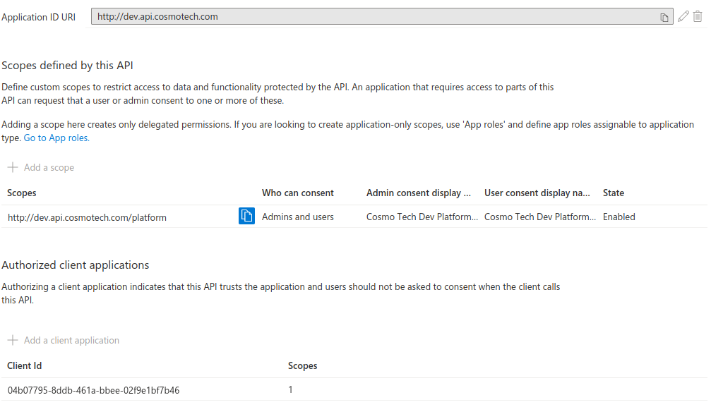

# Azure Requirements

???+ warning "Requirements"
    The following elements are required before you can use Babylon on an Azure subscription
    === "Platform requirements"
        --8<-- "docs/partials/Azure/platform.md"

## Allow access to the API App registrations
Babylon uses the Azure Active Directory to authenticate users and allow them to interact with the API. To do so, Babylon needs to be registered as an application in the Azure Active Directory.
The App registration will need rights on resources you will have to edit and you will need to expose the API as well.

=== "Correctly set up App Registration"
    
Now the API will allow connections from your App Registration

You can use the following commands to setup your App Registration secrets in your `.secrets.yaml.encrypt` file for `Babylon` to use it directly !
    - [babylon azure login](https://cosmo-tech.github.io/Babylon/latest/cli/#login)
    - [babylon azure logout](https://cosmo-tech.github.io/Babylon/latest/cli/#logout)

## Allow access to the API using `az`

AZ CLI is a software developed by Microsoft allowing an easier interaction with Azure from a terminal. Babylon uses it to connect to Azure and use the Active Directory permissions of the user to interact with all the Azure elements.

By default, most of the Azure services recognize AZ CLI interaction, but the Cosmo Tech API requires some settings to allow the user to connect.

???+ tip "Confirmation command"
    To make sure `az` is correctly set up for your Cosmo Tech Platform you can use the following command to generate an authentication token. 
    If the token is generated you are good to go on the following guides, else we will try to look at important setup actions you could try.
    To use this command you will need an `API Scope`, for `az` you can simply use the URL tied to your api (for example: `http://dev.api.cosmotech.com`)
    === "Generate token"
        ```bash
        az account get-access-token --output json --resource {API Scope}
        # {
        #   "accessToken": "...",
        #   "expiresOn": "...",
        #   "subscription": "...",
        #   "tenant": "...",
        #   "tokenType": "Bearer"
        # }
        ```

Most of the time by running the "Generate token" command you will be able to check where issues can happen while trying to interact with your Cosmo Tech API.

???+ info "Allow `az` to communicate with your API"
    --8<-- "docs/partials/Azure/az_api_registration.md"

???+ info "Ensure your users have rights on the API"
    --8<-- "docs/partials/Azure/az_aad_api_rights.md"
    
    