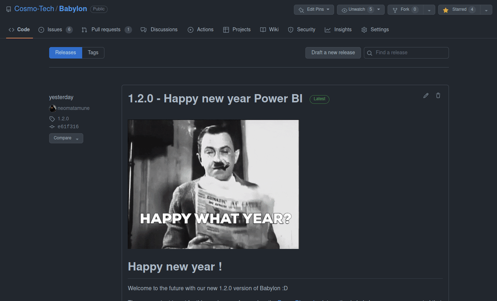

---
tags:
  - Guides
  - Installation
---
# Installation of Babylon

Great ! You chose to use Babylon, I'm sure you won't regret it.

Now we will guide you through the installation process so you can get your hands on Babylon as fast as possible.

So the installation is a fairly simple process which can be separated in 2 parts : get a version of Babylon, and install this version.

## Get Babylon sources

We will go through the process of getting a version of Babylon before the installation.

You can make your choice on how you may want to process :

=== "Get official releases"

    So you choose to use releases, very well, 
    go on the following page to get one of the releases  
    [](https://github.com/Cosmo-Tech/Babylon/releases)

    Then you can select a type of compressed folder you want (`.zip` or `.tar.gz`) and download the file.

    
    
    Now you can decompress the file you downloaded.
    === "Decompress a .zip"
        ```bash
        unzip Babylon-1.2.0.zip
        ```
    === "Decompress a .tar.gz"
        ```bash
        tar -xf Babylon-1.2.0.tar.gz
        ```
    After run you now have a folder named `Babylon-1.2.0` which we will refer to as "Babylon Installation Folder" for the rest of the guide
=== "Use latest version from git"

    You can download the latest version of Babylon using git with the following command
    === "Get sources from git"
        ```bash
        git clone git@github.com:Cosmo-Tech/Babylon.git Babylon-Sources
        ```

    You now have a folder called `Babylon-Sources` which we will refer to as "Babylon Installation Folder" for the rest of the guide

    If you want a specific version of Babylon you can check which version number you want (for example `1.2.0`) and to the following
    
    === "Change the source version from git"
        ```bash
        cd Babylon-Source
        git checkout 1.2.0
        ```

    Now your installation folder will have the code of the version `1.2.0` ready to be used