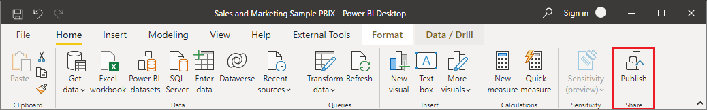

---
hide:
  - toc
---
# Configuring PowerBI reports

!!! info
    To follow this guide you should be familiar with [PowerBI](https://learn.microsoft.com/en-us/power-bi/)

In order to facilitate the creation of Power BI reports and the migration of reports between environments, a few guidelines should be followed.

This guidelines will also ensure that your PowerBI report is compatible with **Babylon**.

!!! note ""
    The whole process is automated along with PowerBI workspace creation in [PowerBI deploy-workspace](../commands/powerbi_deploy_workspace.md)

## Create Power BI reports in Power BI desktop

!!! info "Within PowerBI Desktop"
    1. Create a new Power BI report
    2. Go to section [Transform Data](https://learn.microsoft.com/en-us/power-bi/transform-model/desktop-query-overview) for managing data sources.  
    
    3. Create parameters in the report  
    
        1. Create parameter **ADX_cluster**: URL of the ADX cluster (e.g.: phoenixdev.westeurope.kusto.windows.net)
        2. Create parameter **ADX_database**: Name of the ADX database (e.g.: o-xxxxxxxx-brewerydemo)
    
    4. Create a new Data Source of type Azure > Azure Data Explorer (Kusto).
    
    5. Enter the exact value for ADX Cluster, ADX Database and ADX Table (e.g. ScenarioMetadata).
    6. Select DirectQuery as the Data Connectivity Mode.
    
    7. In the query formula, replace ADX cluster and database with the parameter value.
    
    8. Rename the Query (in the query list on the left) after the table name.
    9. Perform [data transformation](https://learn.microsoft.com/en-us/power-bi/transform-model/) as needed.
    10. Create and tune your Power BI Dashboards.

## Publish report to Power BI web portal

Once your Power BI report is ready, publish it to the Power BI Web Portal.

???+ abstract "With Babylon"
    1. Get your workspace id  
      [babylon powerbi workspace get-all](https://cosmo-tech.github.io/Babylon/2.0.0/cli/#get-all_13)
    2. Upload your report  
      `babylon powerbi report upload -w [workspace_id] [myfile.pbix]`  
      [babylon powerbi report upload](https://cosmo-tech.github.io/Babylon/2.0.0/cli/#upload_2)

???+ abstract "With PowerBI Web Portal"
    

## Move report to a new environment

If you want to plug your Power BI report to a new environment you can do it easily by changing its parameters in the PowerBI Web Portal (app.powerbi.com) or with **Babylon**.

???+ abstract "With Babylon"
    1. Get your workspace id  
      [babylon powerbi workspace get-all](https://cosmo-tech.github.io/Babylon/2.0.0/cli/#get-all_13)
    2. Get your dataset id  
      [babylon powerbi dataset get-all](https://cosmo-tech.github.io/Babylon/2.0.0/cli/#get-all_11)
    3. Update parameters  
      `babylon dataset parameters update -w [workspace_id] -p ADX_cluster [adx_cluster] -p ADX_database [adx_database] [dataset_id]`  
      [babylon powerbi dataset parameters update](https://cosmo-tech.github.io/Babylon/2.0.0/cli/#update_8)
    2. Update dataset credentials
      `babylon powerbi dataset update-credentials -w [workspace_id] [dataset_id]`  
      [babylon powerbi dataset update-credentials](https://cosmo-tech.github.io/Babylon/2.0.0/cli/#update-credentials)
    3. The data sources will automatically be updated to read the new environment's data. 
    
???+ abstract "With PowerBI web portal"
    1. Go to the Power BI workspace and access the settings of your report’s Dataset.
    
    2. Update the parameters values (ADX_cluster and ADX_database) with your target environment data. 
    
    3. The data sources will automatically be updated to read the new environment's data. 