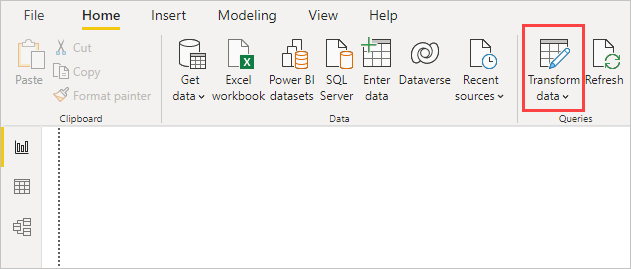

---
hide:
  - toc
---
# Configuring PowerBI reports

In order to facilitate the creation of Power BI reports and the migration of reports between environments, a few guidelines should be followed.

This guidelines will also ensure that your PowerBI report is compatible with **Babylon**.

## Create Power BI reports in Power BI desktop
- Create a new Power BI report and go to **Transform Data** section in order to manage data sources.

### Create parameters in the report

Create 2 parameters:

- **ADX_cluster**: URL of the ADX cluster (e.g.: phoenixdev.westeurope.kusto.windows.net)
- **ADX_database**: Name of the ADX database (e.g.: o-xxxxxxxx-brewerydemo)

### Create a Data source using parameters in Direct Query
- Create a new Data Source of type Azure > Azure Data Explorer (Kusto)

- Enter the exact value for ADX Cluster, ADX Database and ADX Table (e.g. ScenarioMetadata), select DirectQuery as the Data Connectivity Mode.

- In the query formula, replace ADX cluster and database with the parameter value. Then replace the query name with the table name.

- Perform some data transformation if needed.

### Create a dashboard
Create and tune your Power BI Dashboards.

## Publish report to Power BI web portal

Once your Power BI report is ready, publish it to the Power BI Web Portal.

### With Babylon
???+ abstract "Steps"
    - [babylon powerbi report upload](https://cosmo-tech.github.io/Babylon/2.0.0/cli/#upload_2)

### With PowerBI web portal

## Move report to a new environment

If you want to plug your Power BI report to a new environment you can do it easily by changing its parameters in the Power BI Web Portal (app.powerbi.com) or with **Babylon**.

### With Babylon

???+ abstract "Steps"
    - [babylon powerbi dataset parameters update](https://cosmo-tech.github.io/Babylon/2.0.0/cli/#update_8)
    - [babylon powerbi dataset update-credentials](https://cosmo-tech.github.io/Babylon/2.0.0/cli/#update-credentials)

### With PowerBI web portal

- Go to the Power BI workspace and access the settings of your report’s Dataset.

- Update the parameters values (ADX_cluster and ADX_database) with your target environment data. 

The data sources will automatically be updated to read the new environment's data. 